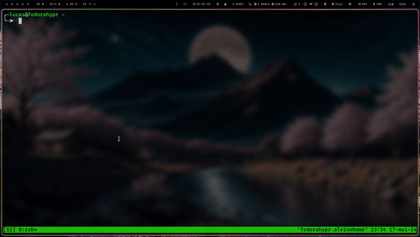

# Kubefzf
Welcome to kubefzf!, with kubefzf you will combine the power of [fzf](https://github.com/junegunn/fzf) in the kubectl command line, so you don't have to list and copy resource names before using the kubectl command, everything will be interactive and you will choose through a menu that has a filter. You need to have [fzf](https://github.com/junegunn/fzf) installed in your system.


## Quick Start

### Install
```
INSTALATION_PATH=~/.kubefzf # you can change here
git clone git@github.com:AleixoLucas42/kubefzf.git $INSTALATION_PATH
echo "alias kf='sh $INSTALATION_PATH/kubefzf.sh'" >> ~/.zshrc 
echo "alias kf='sh $INSTALATION_PATH/kubefzf.sh'" >> ~/.bashrc # optional
source ~/.bashrc
source ~/.zshrc # optional
kf --help
```

### Uninstall
```
INSTALATION_PATH=~/.kubefzf # you can change here
sed -i "/alias kf='sh ${INSTALATION_PATH//\//\\/}\/kubefzf.sh'/d" ~/.bashrc ~/.zshrc # remove alias
rm -rf $INSTALATION_PATH
```

### Usage
Just type `kf` and you will get it

